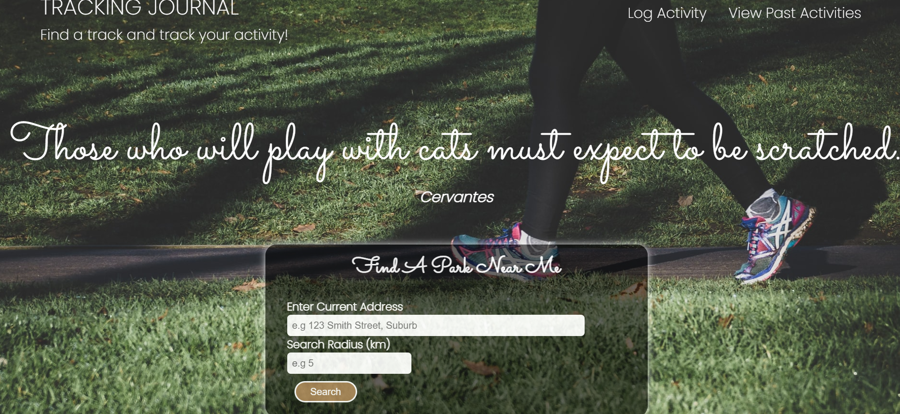
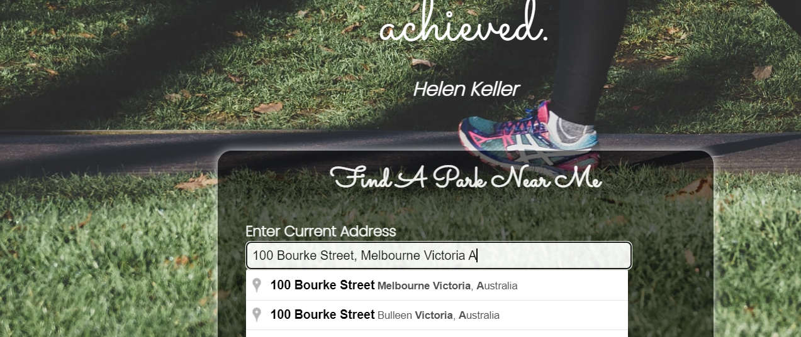
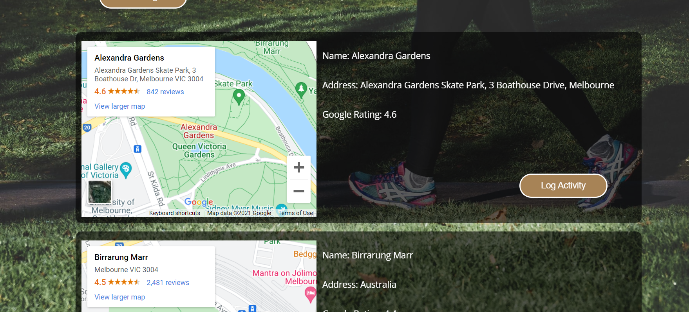
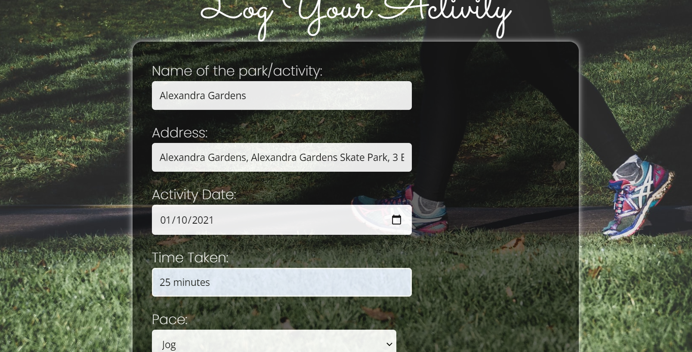
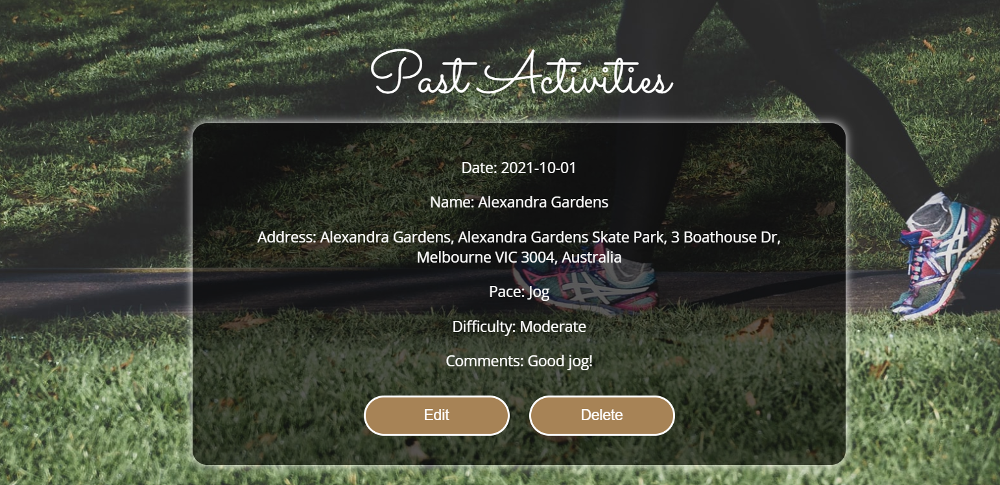

# Tracking Journal

## What is a tracking journal?

- Tracking Journal is an application for users to find parks around a certain radius for a given address and keep track of their experiences.
- Users can enter an address and a radius to get a maximum of 10 results of parks to choose from.
- After selecting a particular result the users can enter the date of activity, time taken, the pace of the activity and add their experince in comments section.
- The activities can be saved for later, which allows them to view, edit and delete their activities.

## User Story

As a user,
I would like to find parks around my area in a given radius,
so I can find new places I have not been before and keep track of all my activities at any given time.

## Technologies used

- HTML
- CSS
- JavaScript
- J-Query
- moment.js
- Google-Maps API
- Open Weather API
- Quote free API

## Team members

- Anna Nguyen - https://github.com/AnnaNguyen1
- Rua Manukau - https://github.com/rmnk-nz
- Sam Hong - https://github.com/s-hong0125
- Srilalitha Nookala - https://github.com/SrilalithaN

## Screenshots

- The following are the screeshots of the application:
  
  
  
  
  

  ## Demo

  - The following is the demo of the application:
    

## Links

- The following is the link to deployed code : https://github.com/AnnaNguyen1/Track-Journal
- The following is the link to deployed application :
  https://annanguyen1.github.io/Track-Journal/homepage.html

## Required extension

- Allow CORS : Access-Control-Allow-Origin :https://chrome.google.com/webstore/detail/allow-cors-access-control/lhobafahddgcelffkeicbaginigeejlf/related

## Resources

- Google
- Knowledge from Class-Activities
- Youtube Tutorials
- Google-Maps API documentation
- Open Weather API documentation
- Quote free API documentation
